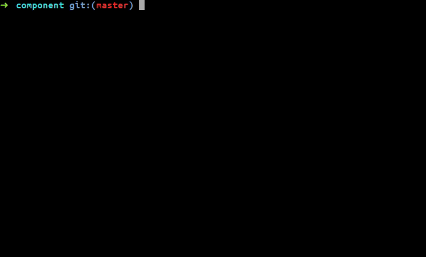

# Automate creating your ReactJs components

When I got frustrated creating components manually and it was all the same work I had to do repeatedly, so I came across this  script to boot my productivity by creating ReactJs components through the shell script with one single command with the code snippet along with the SCSS file too.


=======
## cloning

ssh
```nginx
$ git clone git@github.com:lifeeric/automate-React-Component.git
```
or
https
```nginx
$ git clone https://github.com/lifeeric/automate-React-Component.git
```
Permission
```nginx
$ chmod +x arc
```
make it global
```nginx
$ sudo cp arc /bin
```

## Usage
syntax
```nginx
$ arc [COMPONENT NAME]
```
### example
```nginx
$ arc Header
$ tree
.
└── src
    └── components
        └── Header
            ├── Header.scss
            └── Header.tsx
```

### example 2
```nginx
$ arc Header/Navbar
$ tree
.
└── src
    └── components
        └── Header
            ├── Header.scss
            ├── Header.tsx
            └── Navbar
                ├── Navbar.scss
                └── Navbar.tsx

```


## New features need to be added
It works fine until now for me even if I try to create a nested component, at the moment I'm configured for `TypeScript` only. and hope to add `Javascript`, `CSS` as well. perhaps stop overwriting component
